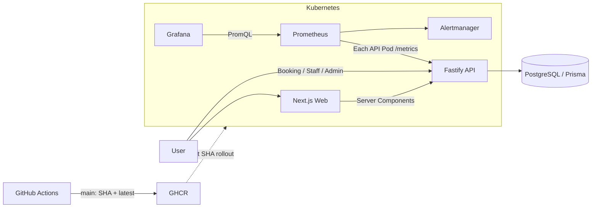

# 牙醫診所官方網站 (Dental Clinic Website)


---

## 🎯 專案目標

打造一個**功能健全、可上雲、可觀察、可持續交付**的牙醫診所官方網站。

## 🧰 技術棧

| 層 | 技術 |
|---|---|
| Frontend | Next.js 16 (App Router, RSC) + TypeScript + Tailwind CSS 4 |
| Backend  | Fastify 5 + TypeScript + Zod |
| ORM      | Prisma 6 |
| Database | PostgreSQL 16 (Alpine) |
| Container| Docker + Docker Compose → Kubernetes (Phase 7) |
| CI/CD    | GitHub Actions (Phase 6) |
| Observability | Prometheus + Grafana + alert rules + SLO (local K8s verified); Loki pending |
| Deployment | Render (live) + Kubernetes manifests (cluster-ready) |
| Kubernetes | Docker Desktop Kubernetes deployed and locally verified |
| Phase progress | Phase 7 complete; Phase 8 core monitoring complete, Loki and external alert delivery pending |

## Current delivery status

- **Product increment (in progress):** Three-step appointment booking, slot
  conflict protection, reference-code lookup/cancellation, and a durable email
  outbox are implemented and validated locally. The email sender is safe for
  Resend sandbox use and remains queued until its environment variables are set.
- **Sandbox email setup:** configure `RESEND_API_KEY`,
  `RESEND_FROM=onboarding@resend.dev`, and `EMAIL_TEST_RECIPIENT` with the
  email verified in Resend. Do not commit these values; add them to Render's
  environment settings instead.
- **Still requiring configuration or follow-up:** staff/admin authentication,
  actual admin CRUD UI, case-study assets, Loki, and Alertmanager email routing
  are not marked complete until their credentials/assets or provider settings
  exist.

- **Live demo:** [Web](https://dental-clinic-web.onrender.com) · [API health](https://dental-clinic-api-ylv9.onrender.com/health)
- **Delivery pipeline:** Pull request CI → merge to `main` → Render deployment → scheduled/manual API smoke test.
- **Local Kubernetes:** API and Web each run two ready replicas; migration runs as a Job; Prometheus and Grafana verify API metrics locally.
- **Release:** [v0.1.0](https://github.com/48124812/dental-clinic/releases/tag/v0.1.0)

## Next product backlog

1. **P0 — #3: Three-step online appointment.** Establish the `Appointment`
   model, availability validation, booking API, and patient-facing booking UI.
2. **P0 — #6: Today's appointment dashboard.** Builds on #3 so clinic staff
   can view and update appointment attendance.
3. **P0 — #7: Admin doctor and service management.** Replace demo seed data
   with authenticated management workflows.
4. **P0 — #8: Booking confirmation email.** Add a transactional email provider
   after the appointment creation event exists.
5. **P1 — #11, #12, #13:** Patient self-service, SEO, and the remaining
   observability work (Loki plus external alert delivery).

---

## 🚀 第一次跑（從 clone 開始 5 分鐘上手）

### 前置 (一次性安裝)
1. **Node.js 22+ LTS** — `winget install OpenJS.NodeJS.LTS`
2. **pnpm 10+** — `winget install pnpm.pnpm`
3. **Git** — `winget install Git.Git`
4. **Docker Desktop** — `winget install Docker.DockerDesktop`（並啟動）
5. **GitHub CLI**（選用）— `winget install GitHub.cli`

> Windows PowerShell 補設定：`Set-ExecutionPolicy -Scope CurrentUser RemoteSigned`（以管理員）

### 跑起來

A full-stack appointment and clinic operations platform built around a reliable booking workflow, automated testing and delivery, containerized deployment, Kubernetes, and observability.

This is an engineering portfolio project and is not intended to process real patient data in production.

## Live demo

- [Web demo](https://dental-clinic-web.onrender.com)
- [API health](https://dental-clinic-api-ylv9.onrender.com/health)

These are recorded deployment addresses; availability and the deployed revision have not been revalidated in this documentation pass. Use the [Technical Demo Guide](docs/DEMO.md) for a reproducible local demonstration with synthetic data. Do not run load tests against the public demo.

## Core features

- Three-step booking: choose a doctor and time, enter synthetic contact details, and receive a reference code.
- Appointment lookup with a reference code and exactly four phone suffix digits; cancellation at least 24 hours before the appointment.
- Staff appointment dashboard with attendance updates.
- Admin catalog for creating, viewing, editing, and deactivating doctors and services. Deactivation uses `active=false`; there is no hard-delete API.
- Public doctor, treatment, business-hours, and case-study pages.

## Architecture diagram



PostgreSQL is external to the Kubernetes cluster. Ingress routes browser `/api` requests to Fastify; server-side Web requests use `INTERNAL_API_URL`. Render is a separate commit-triggered deployment path. Publishing to GHCR does not automatically deploy Kubernetes.

## Technology stack

| Layer | Technologies |
| --- | --- |
| Frontend | Next.js 16 App Router, React, TypeScript, Tailwind CSS 4 |
| Backend | Fastify 5, TypeScript, Zod |
| Database | PostgreSQL 16, Prisma 6 |
| Infrastructure | Docker, Docker Compose, Kubernetes, Kustomize |
| Delivery | GitHub Actions, GHCR, Render Blueprint |
| Observability | prom-client, Prometheus, Grafana, Alertmanager |

## Engineering highlights

- **Booking consistency:** a PostgreSQL partial unique index reserves doctor/time slots only for non-cancelled appointments. Cancellation preserves history and allows rebooking; concurrent conflicts return 409. Appointment and email-outbox records are committed in one transaction.
- **Deterministic tests:** Fastify `inject()` exercises real routes, validation, authorization, and services with isolated persistence and email mocks; a fixed clock covers cancellation boundaries.
- **Delivery checks:** PRs run install, Prisma generation, lint, type-check, tests, load-script safety checks, production build, and Docker image builds. Only pushes to `main` publish GHCR images, tagged with commit SHA and `latest`.
- **Deployment controls:** separate migration Jobs precede application rollout; deployment instructions use SHA-tagged images. `/health` checks process liveness, while `/ready` checks database reachability.
- **Operational visibility:** each API Pod has a separate metrics target. Dashboards show request rate, 5xx ratio, p95 latency, process CPU, and RSS memory. Raw request data is excluded from normal logs and metric labels.
- **Scaling configuration:** an opt-in HPA targets 65% CPU utilization with 2–10 replicas. k6 scripts restrict targets and default to a short, read-only smoke profile.

The repository contains routes, services, and repositories; some services and Admin routes call Prisma directly. It is not a claim that every module follows an identical layering pattern.

## Quick start

Requirements: Node.js 22+, pnpm 10 (repository pin: 10.0.0), and Docker Desktop. Run from the repository root in PowerShell. Copy templates only on first setup; preserve existing local configuration.

```powershell
pnpm install --frozen-lockfile
Copy-Item .env.example .env
Copy-Item apps/api/.env.example apps/api/.env
Copy-Item apps/web/.env.local.example apps/web/.env.local
pnpm --filter @dental-clinic/api db:generate

docker compose up -d postgres
# Wait for PostgreSQL to report healthy before applying migrations.
docker compose ps
pnpm --filter @dental-clinic/api db:migrate:deploy
pnpm --filter @dental-clinic/api db:seed
pnpm dev
```

Web: `http://localhost:3000`; API: `http://localhost:3001`. Use only synthetic records. Optional API credentials should remain commented out when unused, because empty values fail Zod validation. Staff/Admin tokens are separate values of at least 24 characters and must never be placed in `NEXT_PUBLIC_*` variables.

| Local file | Purpose |
| --- | --- |
| `.env` | Compose database/build settings; template credentials are local-demo placeholders |
| `apps/api/.env` | Database connection, CORS, optional role tokens and email configuration |
| `apps/web/.env.local` | Public API origin and site URL; public variables are embedded at build time |

For the complete Docker stack, optional role-token injection, migration/seed steps, and cleanup, follow [Local Docker Demo](docs/DEMO.md#local-docker-demo).

## Test and verification

```powershell
pnpm lint
pnpm typecheck
pnpm test
pnpm test:load-config
pnpm test:integration # Isolated Docker PostgreSQL; includes migration and concurrent-booking tests.
pnpm build
docker compose config --quiet
kubectl kustomize k8s/base
kubectl kustomize k8s/observability
kubectl kustomize k8s/autoscaling
```

- Application tests: **68 passing** (API 58, Web 10), including email failure privacy and strict unhandled-rejection subprocess checks.
- PostgreSQL integration tests: **11 passing**, separately run via `pnpm test:integration`; includes blank database migration, upgrade with retained records, cancellation/rebooking, Staff transition races, and two rounds of eight simultaneous booking requests (one 201 and seven 409 per round). This is correctness verification, not a capacity test.
- Offline load-script safety checks: **13 passing**; they generate no HTTP traffic.
- Lint, type-check, and production build pass. Kustomize rendering validates configuration, not running workloads.
- A previous isolated Docker smoke run completed migration, synthetic seed, readiness, and **15/15 HTTP 200 responses** at 1 VU for 15 seconds. This verifies connectivity, responses, and thresholds, not capacity or autoscaling.
- [Verification records](docs/09-project-verification.md) distinguish current checks from historical execution evidence. Cloud deployment, browser E2E, and external alert delivery are not covered by these local checks.

## Current limitations

- **HPA configured, pending runtime verification.** Metrics Server and a complete scale-up/scale-down experiment are still required.
- **Authentication currently uses environment-managed tokens.** Individual accounts, production identity management, SSO, and fine-grained RBAC remain incomplete.
- **Background email retry remains incomplete.** The persisted outbox triggers an immediate best-effort send attempt, with service and caller error boundaries. Failures produce safe structured logs without failing the committed booking. There is no retry worker or exactly-once guarantee; `retryable` is diagnostic metadata, not automatic retry. Local PostgreSQL booking concurrency is tested; distributed failure recovery and capacity have not been verified.
- Availability currently uses fixed time slots; full scheduling validation, rate limiting, browser E2E, and real case-study assets remain incomplete.
- Resend sandbox delivery requires external configuration and a verified test recipient. Alertmanager SMTP delivery, Loki, persistent monitoring storage, and long-term SLO evidence remain incomplete.

## Technical documentation

- [Technical Demo Guide](docs/DEMO.md)
- [Booking uniqueness, migration safety, and PostgreSQL tests](docs/12-booking-consistency.md)
- [Architecture decisions](docs/adr/README.md)
- [Docker](docs/04-phase-5-containerization.md) · [Render](docs/05-render-deployment.md) · [Kubernetes / SHA rollout](docs/06-kubernetes-deployment.md)
- [Observability](docs/08-observability.md) · [Verification records](docs/09-project-verification.md)
- [HPA setup](docs/10-autoscaling-load-test.md) · [k6 scripts](load-tests/README.md)

The project originated in cloud-native coursework and was extended with appointment workflows, test coverage, delivery automation, and operational tooling. The [original discovery](docs/01-discovery.md), [retrospective](docs/03-sprint-1-retrospective.md), and [learning notes](docs/LEARNING-NOTES.md) preserve that history; they are not the current deployment runbook.

The repository identifier remains `dental-clinic`; package names, Docker image names, and Kubernetes resource names are unchanged. UNLICENSED.
