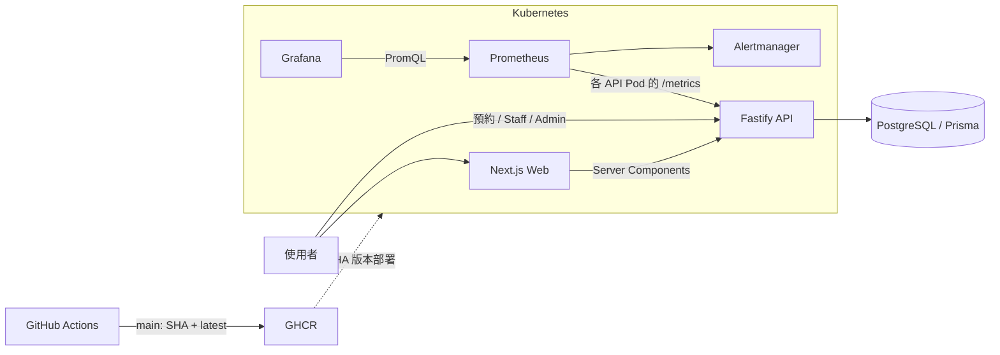

# Cloud-Native Dental Appointment Platform

雲端原生牙醫預約平台：整合線上預約與診所日常作業的全端應用，著重可靠的預約流程、自動化測試與交付、容器化部署、Kubernetes 設定與可觀測性。

**本專案為工程作品展示，不適合在正式環境處理真實病患資料。**

<a id="live-demo"></a>
## 線上展示

- [開啟網站 Demo](https://dental-clinic-web-ejw6.onrender.com)
- [API 健康檢查](https://dental-clinic-api-ylv9.onrender.com/health)

**公開預約流程不需要啟動本機環境、設定環境變數或登入 Render。**

1. 瀏覽[醫師團隊](https://dental-clinic-web-ejw6.onrender.com/doctors)與[療程項目](https://dental-clinic-web-ejw6.onrender.com/services)。
2. 進入[線上預約](https://dental-clinic-web-ejw6.onrender.com/appointments/new)，選擇至少兩天後的時段，僅填寫假資料，並保存預約編號（reference code）。
3. 使用編號與手機末四碼[查詢及取消](https://dental-clinic-web-ejw6.onrender.com/appointments/lookup)，再重新預約相同時段。展示結束後，也請取消最後一筆測試預約。

完整步驟與安全的假資料範例見[三分鐘線上 Demo 與備用流程](docs/DEMO.md#online-demo-script-3-minutes)。另可查看 [GitHub 原始碼](https://github.com/48124812/dental-clinic)與 [CI 執行結果](https://github.com/48124812/dental-clinic/actions)。

**首次載入：** Render Free 服務閒置後可能休眠，啟動約需一分鐘；Web 與 API 可能分別啟動。若仍無法連線，請改用指南中的備用流程，不要重複送出預約。相關行為見 [Render 免費服務文件](https://render.com/docs/free)。

**驗證紀錄（2026-09-21，台北時間）：** 已確認修正後的 Web 網址，以及公開預約、取消、重訂流程可用。首次 API 健康檢查耗時 42.40 秒；這是單次觀測的請求時間，不是冷啟動時間保證。詳見[實測結果與部署證據](docs/07-deployment-verification.md#online-readiness-audit-2026-09-21)。

**展示限制：** 僅限假資料。Staff／Admin 需要由環境變數管理的私人 Token，不屬於匿名展示範圍；Email 不保證送達。本次線上驗證不代表 Kubernetes 已部署；**HPA 已完成設定，尚待執行環境驗證（configured, pending runtime verification）**。其餘見[目前限制](#current-limitations)。禁止對 Render 執行負載測試。

<a id="core-features"></a>
## 核心功能

- 三步驟預約：選擇醫師與時段、填寫合成聯絡資料、取得預約編號。
- 使用預約編號與完整手機末四碼查詢；距預約至少 24 小時才可取消。
- Staff 預約看板，可更新到診狀態。
- Admin 醫師與療程管理，支援新增、查詢、編輯及停用。停用使用 `active=false`，沒有直接刪除資料的 API。
- 公開的醫師、療程、營業時間與案例頁面。

<a id="architecture-diagram"></a>
## 架構圖



在此 Kubernetes 部署設計中，PostgreSQL 位於叢集外部。Ingress 將瀏覽器的 `/api` 請求導向 Fastify；Web 伺服器端透過 `INTERNAL_API_URL` 呼叫 API。Render 是另一條由 Commit 觸發的部署路徑；發布映像至 GHCR 不會自動部署 Kubernetes。

<a id="technology-stack"></a>
## 技術棧

| 層級 | 技術 |
| --- | --- |
| 前端 | Next.js 16 App Router、React、TypeScript、Tailwind CSS 4 |
| 後端 | Fastify 5、TypeScript、Zod |
| 資料庫 | PostgreSQL 16、Prisma 6 |
| 基礎設施 | Docker、Docker Compose、Kubernetes、Kustomize |
| 自動化交付 | GitHub Actions、GHCR、Render Blueprint |
| 可觀測性 | prom-client、Prometheus、Grafana、Alertmanager |

<a id="engineering-highlights"></a>
## 工程重點

- **預約一致性：** PostgreSQL Partial Unique Index（部分唯一索引）只對非取消預約限制醫師與時段的唯一性。取消後保留歷史並釋放時段；同時搶同一時段的衝突回傳 `409`。預約與 Email Outbox 紀錄在同一筆交易中提交。
- **可重現測試：** 透過 Fastify `inject()` 測試實際路由、資料驗證、權限檢查與 Service，搭配隔離的資料存取及 Email Mock；以固定時鐘驗證取消期限邊界。
- **交付檢查：** PR 執行套件安裝、Prisma Generate、Lint、型別檢查、測試、負載腳本安全檢查、Production Build 與 Docker Image Build。只有推送到 `main` 才發布 GHCR 映像，並保留 Commit SHA 與 `latest` 標籤。
- **部署控制：** 獨立的 Migration Job 在應用程式更新前執行，部署文件以 SHA 標籤指定映像版本。`/health` 檢查程序是否存活，`/ready` 檢查資料庫是否可連線。
- **運行狀態觀測：** 每個 API Pod 都有獨立的 Metrics Target。Dashboard 顯示請求速率、5xx 比率、p95 延遲、程序 CPU 與 RSS 記憶體；一般 Log 與 Metric Label 不包含原始請求資料。
- **擴縮設定：** 選用的 HPA 以 CPU 使用率 65% 為目標，副本數介於 2–10。k6 腳本限制測試目標，預設執行短時間、唯讀的 Smoke Test（冒煙測試）。

專案包含 Route、Service 與 Repository；部分 Service 及 Admin 路由直接呼叫 Prisma，並非所有模組都採取完全相同的分層方式。

<a id="quick-start"></a>
## 本機快速啟動

需要 Node.js 22+、pnpm 10（專案固定版本為 10.0.0）與 Docker Desktop。請在 repository 根目錄使用 PowerShell 執行。環境範本僅在首次設定時複製，勿覆蓋既有本機設定。

```powershell
pnpm install --frozen-lockfile
Copy-Item .env.example .env
Copy-Item apps/api/.env.example apps/api/.env
Copy-Item apps/web/.env.local.example apps/web/.env.local
pnpm --filter @dental-clinic/api db:generate

docker compose up -d postgres
# 等待 PostgreSQL 顯示 healthy，再執行 Migration。
docker compose ps
pnpm --filter @dental-clinic/api db:migrate:deploy
pnpm --filter @dental-clinic/api db:seed
pnpm dev
```

Web：`http://localhost:3000`；API：`http://localhost:3001`。僅使用合成資料。未使用的選填 API 憑證請保留註解，不要設為空字串，否則會無法通過 Zod 驗證。Staff／Admin Token 應分別設定，長度至少 24 字元，且不得放入 `NEXT_PUBLIC_*` 環境變數。

| 本機檔案 | 用途 |
| --- | --- |
| `.env` | Compose 資料庫與建置設定；範本憑證僅為本機展示用的佔位值 |
| `apps/api/.env` | 資料庫連線、CORS、選填的角色 Token 與 Email 設定 |
| `apps/web/.env.local` | 公開 API Origin 與網站網址；公開變數會在建置時嵌入前端 |

完整 Docker 啟動、選用的角色 Token 注入、Migration／Seed 與清理步驟，請參考[本機 Docker Demo](docs/DEMO.md#local-docker-demo)。

<a id="test-and-verification"></a>
## 測試與驗證

```powershell
pnpm lint
pnpm typecheck
pnpm test
pnpm test:load-config
pnpm test:integration # 使用隔離的 Docker PostgreSQL，包含 Migration 與並發預約測試。
pnpm build
docker compose config --quiet
kubectl kustomize k8s/base
kubectl kustomize k8s/observability
kubectl kustomize k8s/autoscaling
```

以下為已記錄的驗證結果；各輪實際執行範圍與日期以[驗證紀錄](docs/09-project-verification.md)為準。

- 應用程式測試：**77 項通過（API 58、Web 19）**，涵蓋安全預約錯誤提示、Email 失敗時的資料保護，以及嚴格模式下未處理 Promise Rejection 的子程序檢查。
- PostgreSQL 整合測試：**11 項通過**，透過 `pnpm test:integration` 獨立執行。涵蓋空白資料庫 Migration、保留紀錄的升級、取消與重訂、Staff 狀態更新競爭，以及兩輪各八筆同時預約請求（每輪一筆 `201`、七筆 `409`）。這是正確性驗證，不是容量測試。
- 離線負載腳本安全檢查：**13 項通過**，不會產生 HTTP 流量。
- Lint、型別檢查與 Production Build 通過。Kustomize 渲染僅驗證設定，不代表工作負載已實際運行。
- 先前的隔離 Docker Smoke Test 已完成 Migration、合成資料 Seed、Readiness 檢查，並在 1 VU、15 秒內取得 **15/15 次 HTTP 200**。這僅驗證連線、回應與門檻，不代表容量或自動擴縮能力。
- [驗證紀錄](docs/09-project-verification.md)區分各輪檢查與歷史執行證據；另外的[線上驗證](docs/07-deployment-verification.md#online-readiness-audit-2026-09-21)涵蓋公開瀏覽器預約流程。外部告警送達仍未驗證。

<a id="current-limitations"></a>
## 目前限制

- **HPA 已完成設定，尚待執行環境驗證（configured, pending runtime verification）。** 仍需 Metrics Server 與完整的 Scale Up／Scale Down 實驗。
- **目前使用環境變數管理的 Token 進行身分驗證。** 個人帳號、正式環境身分管理、SSO 與細緻的 RBAC 尚未完成。
- **背景 Email 重試尚未完成。** 預約提交後，持久化的 Outbox 會觸發一次盡力寄送，Service 與呼叫端均有錯誤保護。失敗時記錄安全的結構化 Log，不會使已提交的預約失敗。目前沒有 Retry Worker 或 Exactly-once 保證；`retryable` 只是診斷資訊，不代表自動重試。已驗證本機 PostgreSQL 的並發預約正確性，但未驗證分散式故障復原與容量。
- 可預約時間目前採固定時段；完整排班驗證、Rate Limiting、完整瀏覽器 E2E 測試與真實案例素材仍未完成。
- Resend Sandbox 寄送需要外部設定與已驗證的測試收件人。Alertmanager SMTP 送達、Loki、監控資料持久化與長期 SLO 證據仍未完成。

<a id="technical-documentation"></a>
## 技術文件

- [技術 Demo 指南](docs/DEMO.md)
- [預約唯一性、Migration 安全與 PostgreSQL 測試](docs/12-booking-consistency.md)
- [架構決策紀錄](docs/adr/README.md)
- [Docker](docs/04-phase-5-containerization.md) · [Render](docs/05-render-deployment.md) · [Kubernetes／SHA 版本部署](docs/06-kubernetes-deployment.md)
- [可觀測性](docs/08-observability.md) · [驗證紀錄](docs/09-project-verification.md)
- [HPA 設定](docs/10-autoscaling-load-test.md) · [k6 腳本](load-tests/README.md)

本專案起源於雲端原生課程，後續擴充預約流程、測試、自動化交付與維運工具。[初期需求探索](docs/01-discovery.md)、[回顧紀錄](docs/03-sprint-1-retrospective.md)與[學習筆記](docs/LEARNING-NOTES.md)保留了開發背景，但不作為目前的部署操作手冊。

Repository 名稱維持 `dental-clinic`；Package、Docker Image 與 Kubernetes Resource 名稱不變。授權標示：`UNLICENSED`。
